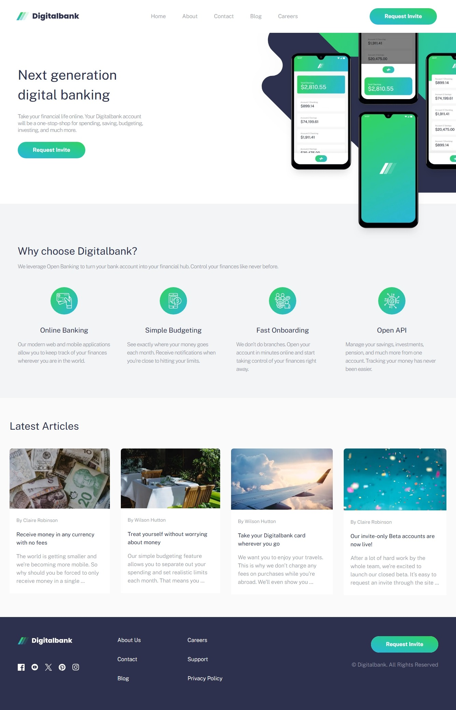

# Frontend Mentor - Digitalbank landing page solution

This is a solution to the [Digitalbank landing page challenge on Frontend Mentor](https://www.frontendmentor.io/challenges/digital-bank-landing-page-WaUhkoDN). Frontend Mentor challenges help you improve your coding skills by building realistic projects.

## Table of contents

- [Overview](#overview)
  - [The challenge](#the-challenge)
  - [Links](#links)
- [My process](#my-process)
  - [Built with](#built-with)
  - [Continued development](#continued-development)
- [Author](#author)

**Note: Delete this note and update the table of contents based on what sections you keep.**

## Overview

### The challenge

Users should be able to:

- View the optimal layout for the site depending on their device's screen size
- See hover states for all interactive elements on the page

### Screenshot

### Live Site

- Live Site URL: https://digibank-frontendmentor.netlify.app/

## My process

### Built with

- Semantic HTML5 markup
- CSS custom properties
- Flexbox
- CSS Grid
- Mobile-first workflow
- TypeScript
- [React](https://reactjs.org/) - JS library
- [Next.js](https://nextjs.org/) - React framework

### Continued development

- flex grow / shrink
- be more consistent / organised with components, i.e have all components in components folder.

## Author

- Github - [syed-45](https://github.com/syed-45)
- Frontend Mentor - [@yourusername](https://www.frontendmentor.io/profile/yourusername)
